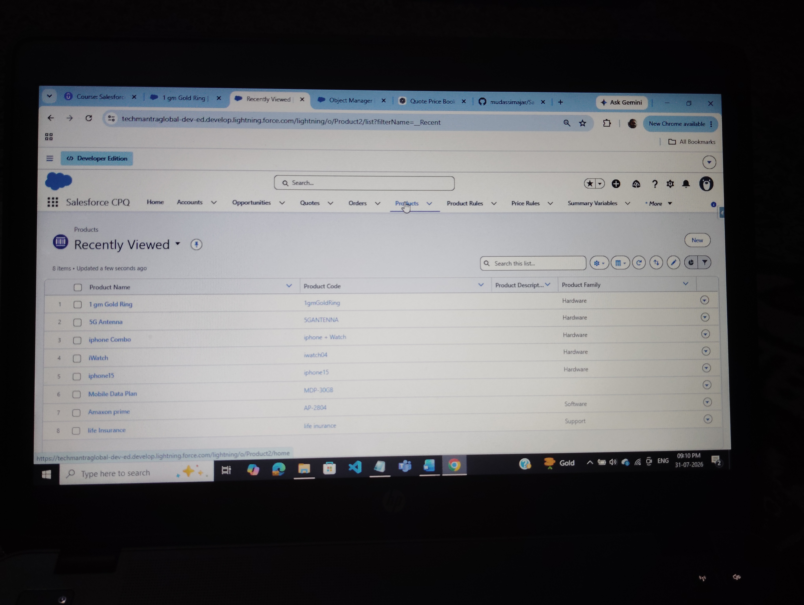
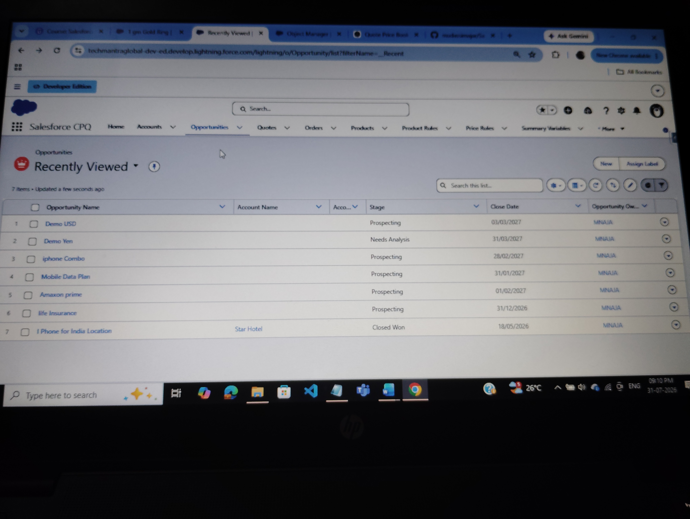

# Salesforce CPQ - Multi Currency

## Overview

This project demonstrates how Salesforce CPQ handles multiple currencies using Price Books and Quotes.

---

## Business Scenario

A product named **1 gm Gold Ring** was created.

The product was added to the Standard Price Book with prices in different currencies.

Initially, the product was not appearing in the Quote Line Editor.

---

## Problem

The Quote Currency was **INR**, while the Product Price Book Entry Currency was **USD**.

Since the currencies were different, Salesforce CPQ did not display the product.

---

## Root Cause

A Quote only supports **one currency**.

Products are shown only if the **Price Book Entry Currency** matches the **Quote Currency**.

---

## Solution

Changed the Quote Currency from **INR** to **USD**.

---

## Result

The product appeared successfully in the Quote Line Editor.

---

# Screenshots

## Product

---

## Opportunity

---

## Quote

---

## Quote Line

